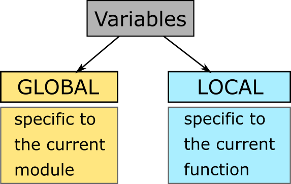

Local vs global variables
=========================

In Python, you can use two kinds of variables: - **global variables**:
defined outside functions. They are accessible everywhere inside the
module (module = file with .py extension). - **local variables**:
created inside functions. They are accessible only inside the function
in which they are created.

**WARNING**: a local variable can have the same name than a global
variable. In that case, the global variable cannot be accessed normally
within that function: it is *shadowed* by the local variable.

Python variables
~~~~~~~~~~~~~~~~

   python\_global\_local\_vars.png

**Rule 1**: functions have access to global variables:

.. code:: ipython3

    global_var = "I'm a global variable"
    
    def my_function():
        # a function can access variables defined outside of it
        print(global_var)
        
    my_function()

.. parsed-literal::

    I'm a global variable

**Rule 2**: variable assignments (i.e. using operator =) in a function
create or act on local variables.

**Rule 3**: a local and a global variable with the same name can
coexist. If a local variable has the same name as a global one, using
the name will access the **local** variable (*variable shadowing*).

.. code:: ipython3

    var = "I'm a global variable"
    
    def my_function():
        # create a local variable named 'var' 
        var = "I'm a local variable"
        # if a local variable has the same name as a global one, Python will access the local variable
        print(var)
        
    my_function()
    # the global variable has not been modified
    print(var)

.. parsed-literal::

    I'm a local variable
    I'm a global variable

Don't want to lose your modifications? Use the **return** statement:

.. code:: ipython3

    var = "I'm a global variable"
    
    def my_function():
        # variable assignments (i.e. using operator =) in a function create or act on local variables
        var = "I'm a global variable and I have been modified"
        # Don't want to lose your modifications? Use the return statement
        return var
    
    # set new content to the variable 'var'
    var = my_function()
    # the variable 'var' has been modified
    print(var)

.. parsed-literal::

    I'm a global variable and I have been modified

**Rule 4**: Input arguments are local variables. Use the **return**
statement If you want to keep back your modifications after the call to
the function:

.. code:: ipython3

    var = "I'm a variable called 'var'"
    
    def my_function(var):
        # input arguments are local
        print('local variables:', locals())
        # modifications on input arguments are not kept after function call
        var = "I'm an input argument and I'm local to the function"
        print(var)
        
    my_function(var)
    # the global variable has not been modified
    print(var)

.. parsed-literal::

    local variables: {'var': "I'm a variable called 'var'"}
    I'm an input argument and I'm local to the function
    I'm a variable called 'var'

.. code:: ipython3

    var = "I'm a global variable"
    
    def my_function(var):
        # modifications on input arguments are not kept after function call
        # input arguments are local
        var = "I'm an input argument and I'm local to the function"
        # use return statement to keep back your modifications
        return var
        
    # set new content to the variable 'var'
    var = my_function(var)
    # the variable 'var' has been modified
    print(var)

.. parsed-literal::

    I'm an input argument and I'm local to the function

Time to practice
~~~~~~~~~~~~~~~~

Do exercises 1 and 2

   global\_variables\_meme\_2.jpg

End of story? Nope.

Python can be vicious as a snake...

In Python, you have to manipulate two kinds of objects: - **Immutable
objects**: int, float, boolean, string, tuple. - **Mutable objects**:
list, dict, Axes, LArray, Session, ...

Specific rules applies to **mutable** objects.

Mutable objects (list, dict, Axes, LArray, Session, ...)
~~~~~~~~~~~~~~~~~~~~~~~~~~~~~~~~~~~~~~~~~~~~~~~~~~~~~~~~

**Rule 5**: Modifying **elements** of a **mutable** variable (list,
dictionary, array, session, ...) does not create a new local variable:

.. code:: ipython3

    from larray import *
    
    array_1 = zeros('sex = F,M')
    array_2 = ones('country = be,fr,de')
    
    def my_function():
        # assigning the whole array creates a new local array
        array_1 = ones('sex = F,M')
        # assigning a subset of an array does not create a local array
        array_2['fr,de'] = 0
    
    print("array_1:")
    print(array_1)
    print("\narray_2:")
    print(array_2)
    
    print("\nlet's call 'my_function' and try to modify array_1 and array_2\n")
    my_function()
    
    print("array_1 has not been modified:")
    print(array_1)
    print("\narray_2 has been modified:")
    print(array_2)

.. parsed-literal::

    array_1:
    sex    F    M
         0.0  0.0
    
    array_2:
    country   be   fr   de
             1.0  1.0  1.0
    
    let's call 'my_function' and try to modify array_1 and array_2
    
    array_1 has not been modified:
    sex    F    M
         0.0  0.0
    
    array_2 has been modified:
    country   be   fr   de
             1.0  0.0  0.0

Why?

Assigning a new value to an object (x = 5, y = [0, 1, 2, 3]) creates a
new object.

Instead, modifying elements of a mutable object (y[1:3] = [0, 0]) does
not create a new object but modifies the existing object.

What if want to modify the whole content of an array?

**Rule 6**: To change the whole content of an array without creating a
new local one, add **[:]** next to the array:

.. code:: ipython3

    from larray import *
    
    array_1 = zeros('sex = F,M')
    
    def my_function():
        # trick: to change to whole content of an array, add [:] next to the array
        array_1[:] = ones('sex = F,M')
    
    print("array_1:")
    print(array_1)
    
    print("\nlet's call 'my_function' and try to modify the whole content of array_1 using [:]\n")
    my_function()
    
    print("array_1 has been modified:")
    print(array_1)

.. parsed-literal::

    array_1:
    sex    F    M
         0.0  0.0
    
    let's call 'my_function' and try to modify the whole content of array_1 using [:]
    
    array_1 has been modified:
    sex    F    M
         1.0  1.0

What about input arguments?

**Rule 7**: Modifying **elements** of a **mutable** input argument
(list, dictionary, array, session, ...) modify also the content of the
associated variable passed to the function:

.. code:: ipython3

    from larray import *
    
    array_1 = zeros('sex = F,M')
    array_2 = ones('country = be,fr,de')
    
    def my_function(arr_1, arr_2):
        # assigning the whole array creates a new array
        arr_1 = ones('sex = F,M')
        # assigning a subset of an array does not create a new array
        arr_2['fr,de'] = 0
    
    print("array_1:")
    print(array_1)
    print("\narray_2:")
    print(array_2)
    
    print("\nlet's call 'my_function' and try to modify array_1 and array_2\n")
    my_function(array_1, array_2)
    
    print("array_1 has not been modified:")
    print(array_1)
    print("\narray_2 has been modified:")
    print(array_2)

.. parsed-literal::

    array_1:
    sex    F    M
         0.0  0.0
    
    array_2:
    country   be   fr   de
             1.0  1.0  1.0
    
    let's call 'my_function' and try to modify array_1 and array_2
    
    array_1 has not been modified:
    sex    F    M
         0.0  0.0
    
    array_2 has been modified:
    country   be   fr   de
             1.0  0.0  0.0

What to remember?
~~~~~~~~~~~~~~~~~

**For all objects**:

1. Functions have access to global variables.
2. Variable assignments (i.e. using operator =) in a function create or
   act on local variables.
3. A local and a global variable with the same name can coexist. If a
   local variable has the same name as a global one, using the name will
   access the **local** variable (*variable shadowing*).
4. Input arguments are local variables. Use the **return** statement If
   you want to keep back your modifications after the call to the
   function.

**For mutable objects (list, dict, Axes, LArray, Session, ...)**:

5. Modifying **elements** of a **mutable** variable does not create a
   new local variable (e.g. pop[10:99] = 0).
6. To change the whole content of an array without creating a new local
   one, add **[:]** next to the array (e.g. pop[:] = 0).
7. Modifying **elements** of a **mutable** input argument modify also
   the content of the variable passed to the function (e.g. pop[10:99] =
   0).

Time to practice (mutable objects)
~~~~~~~~~~~~~~~~~~~~~~~~~~~~~~~~~~

Do exercises 3 and 4

   global\_variables\_meme\_2.jpg

Global Variables
~~~~~~~~~~~~~~~~

pro
^^^

-  **Accessibility**: global variables are accessible everywhere
   (assuming they are imported from the module in which they are
   declared)
-  **Typing**: No need to declare them as function arguments and to
   return them.
-  **(PyCharm)**: putting the cursor on them shows their declaration.

cons
^^^^

-  **Variables Shadowing**: global variables can be shadowed by unwanted
   local variables having the same name.
-  **Low Readability**: you need to read the whole the program to
   understand what it does.
-  **Low Predictability**: global variables can be responsible for
   unpredictable side-effects. The program does not crash but produces
   wrong results silently.
-  **Poor testing**: programs with global variables are hard to test
   (especially in case of *spaghetti code*).
-  **Multithreading**: global variables make it much harder or sometimes
   impossible to allow a program (or parts of it) to run on multiple
   processors/cores.

Local Variables
~~~~~~~~~~~~~~~

pro
^^^

-  Since there are local variables, no risk of shadowing.
-  **Divide and Conquer**: make functions independent blocks of code.
-  Given the function name + input arguments + returned variables
   (should be described in docstring), you get all the information you
   need. Functions are like black-boxes with an interface.
-  From a function call, you know what is in and what is out.
-  **Multithreading**: you can more easily and safely run different
   scenarios at the same time on different CPU's.

cons
^^^^

-  Variables must be declared as function arguments and returned if
   modified.
-  Variables must be passed to functions (if input) or stored (if
   output) at each function call.
-  **(PyCharm)**: inside functions, PyCharm lose access to their
   declaration and cannot display it anymore.

**Conclusion**:

Global variables may be dangerous. When it is possible, write functions
as **independent** blocks of code and pass any external variables you
need to work with as input arguments. Use return statement to return
your modifications. However, it is usually OK to use global variables as
*parameters* (read-only variables).

When you have to deal with many variables (arrays), passing them all the
time as function arguments may become cumbersome. Indeed, modifying
**elements** of a *mutable* global variable does not create a local one.
It is then possible to write a model based on "global arrays". Although
this simplifies the writing of functions and increase the speed of model
development, it impacts the readability and predictability of the code
and may lead to tricky side-effects hard to detect. Global variables
must be used carefully.
